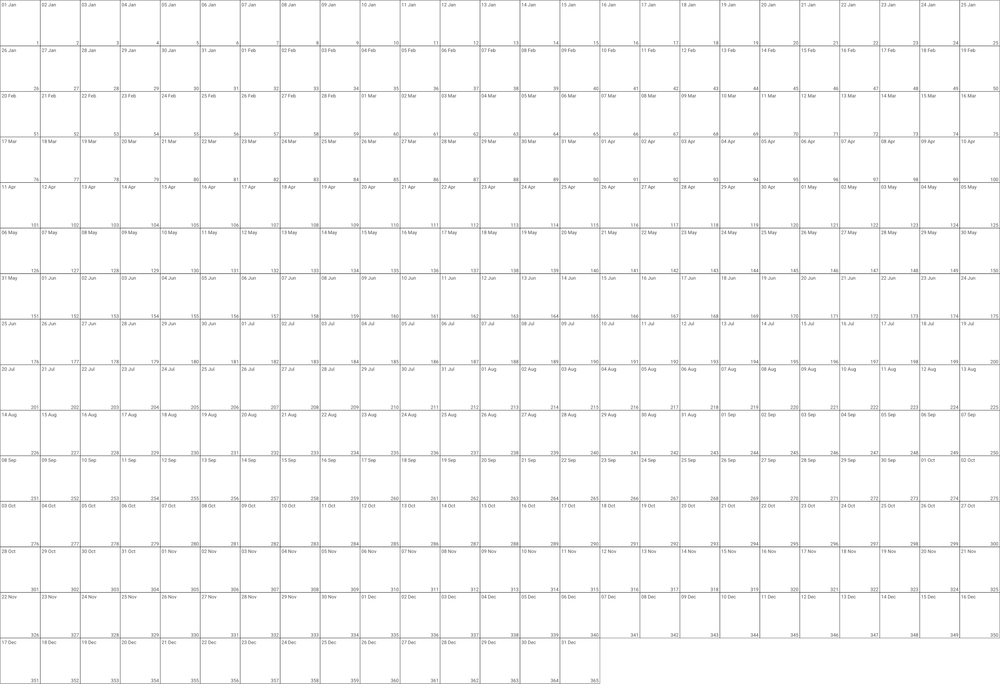

# 365 Days Wall Calendar PDF Generator

Generate a **printable A3 wall calendar** with 365 boxes — one for each day of the year. Perfect for yearly planning, habit tracking, and goal visualization.

<p align="center">
  
</p>

## Download Ready-to-Print PDFs

Pre-generated calendars available in 7 languages:

| Language | Download |
|----------|----------|
| English | [calendar_2026_en.pdf](calendars/calendar_2026_en.pdf) |
| Deutsch | [calendar_2026_de.pdf](calendars/calendar_2026_de.pdf) |
| Français | [calendar_2026_fr.pdf](calendars/calendar_2026_fr.pdf) |
| Русский | [calendar_2026_ru.pdf](calendars/calendar_2026_ru.pdf) |
| Español | [calendar_2026_es.pdf](calendars/calendar_2026_es.pdf) |
| Italiano | [calendar_2026_it.pdf](calendars/calendar_2026_it.pdf) |
| Português | [calendar_2026_pt.pdf](calendars/calendar_2026_pt.pdf) |

## Features

- **A3 printable format** (420×297mm) — fits standard poster frames
- **365 numbered day boxes** — date, month, day of week, and day-of-year number (1-365)
- **Minimalist design** — clean lines, readable fonts, lots of writing space
- **Multi-language support** — easily customize month names for any language
- **Customizable colors** — adjust borders and text colors to your preference
- **Print-ready PDF output** — includes margins for easy printing

## Use Cases

- **Habit tracking** — mark each day you exercise, read, meditate, or code
- **Year-long project planning** — visualize deadlines and milestones at a glance
- **Goal countdown** — track progress toward yearly goals
- **Daily journaling** — use as a prompt for daily reflections
- **Productivity tracking** — see your entire year of work on one page

## Quick Start

**Option 1:** Download a ready-to-print PDF from the table above.

**Option 2:** Generate your own calendars:

```bash
pip install reportlab
python calendar_2026.py
```

This generates all 7 language versions in the `calendars/` folder. Print on A3 paper.

## Customization

Edit settings at the top of `calendar_2026.py`:

```python
YEAR = 2026

COLS = 25          # Grid columns
ROWS = 15          # Grid rows

COLOR_BORDER = "#000000"
COLOR_TEXT = "#555555"
```

### Adding a New Language

Add your language to the `LANGUAGES` dictionary:

```python
LANGUAGES = {
    "en": ["Jan", "Feb", "Mar", ...],
    "de": ["Jan", "Feb", "Mär", ...],
    # Add your language:
    "pl": ["sty", "lut", "mar", "kwi", "maj", "cze", "lip", "sie", "wrz", "paź", "lis", "gru"],
}
```

## Requirements

- Python 3.6+
- [ReportLab](https://www.reportlab.com/)

## License

[MIT](LICENSE)
